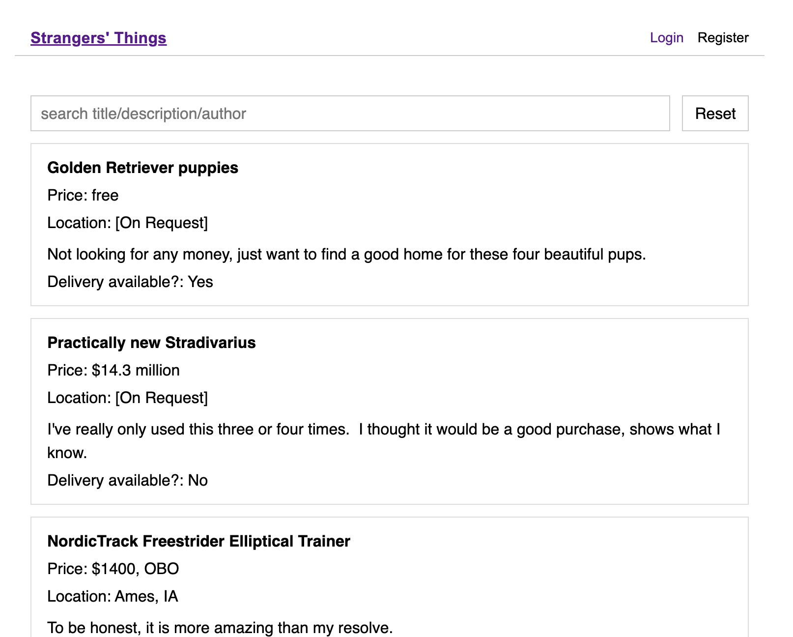
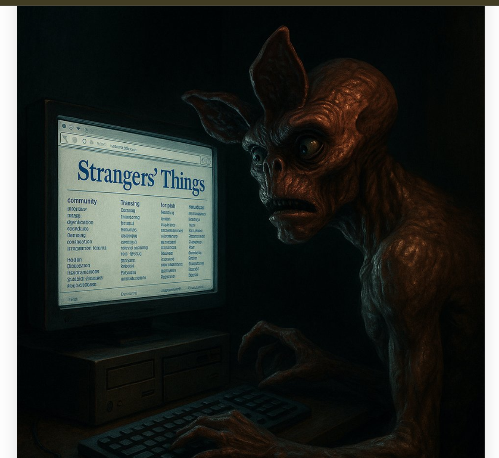
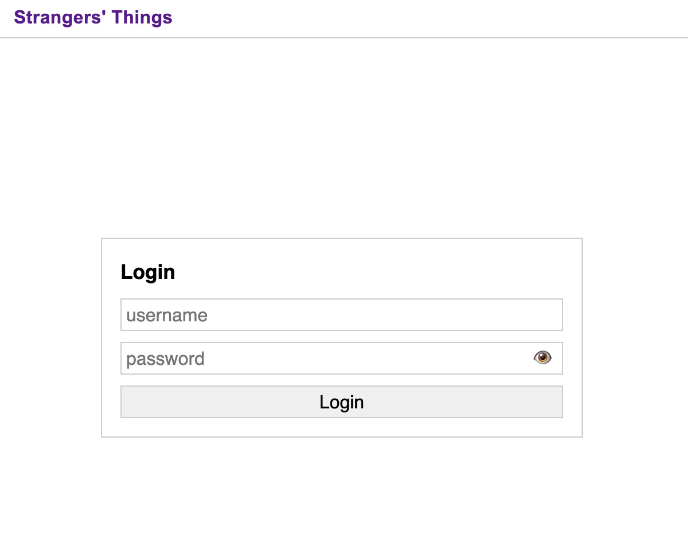
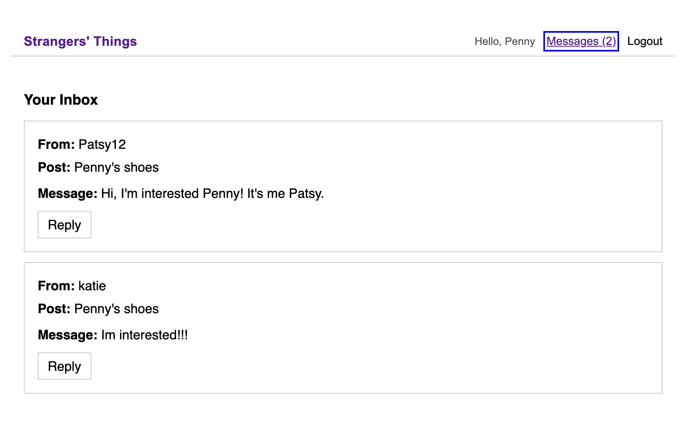

# Strangers Things

🛍️ A not-so-spooky online marketplace!
Strangers Things is a front-end React app that mimics Craigslist functionality, built using the Stranger's Things API from Fullstack Academy. The name is a play on _Stranger Things_ — but instead of monsters and Demogorgons, you'll find posts, messages, and tokens!

## 🌟 Purpose

This project was created to build comfort with React, API integration, token-based authentication, and conditional rendering—while having a little fun with naming along the way.

## 🛠️ Tech Stack

- **Frontend:** React
- **Routing:** React Router DOM
- **Styling:** CSS
- **Auth:** Token-based authentication
- **API:** Stranger's Things REST API

## ✨ Features

- 📝 **Browse all marketplace listings** — see every post in the system, even if you’re not logged in.
- 🔐 **Register and log in** — secure token-based authentication.
- 🛍️ **Create, edit, and delete your own posts** — manage your listings with ease.
- 💬 **Send messages to other users** — contact sellers directly from their posts.
- 🚦 **Dynamic UI** — interface changes automatically based on login state.

## 🚀 Live Demo

Experience Strangers’ Things in your browser:
➡ [Live Demo on Vercel](https://strangers-things-delta.vercel.app/) _(opens in a new tab)_



You can:

- Browse posts without logging in
- Register for a new account to create your own posts
- Send messages to sellers on posts you don’t own
- Edit or delete only the posts you created

**Demo tips**:

- Use a throwaway username/password if you don’t want to sign up with real info
- Public API data may include posts from other users

## 🚀 Getting Started

### Prerequisites

- Node.js
- A code editor like VS Code

### Installation

1. Clone the repo:

   ```bash
   git clone https://github.com/patsylin/strangersThings.git
   cd strangersThings

   ```

2. Install dependencies:

   ```bash
   npm install
   ```

3. Start the app:

   ```bash
   npm run dev
   ```

4. Open your browser:
   ```
   http://localhost:5173
   ```

## 📸 Screenshots

### 🏠 Landing Page



### 🔐 Login Page



### 📬 Messages Inbox



### 📋 Posts List


## 🤝 Contributors

- **Patsy Lin** – Frontend Developer
  [GitHub](https://github.com/patsylin) | [LinkedIn](https://linkedin.com/in/patsy-lin)

## 📬 Contact

📧 pohutchison@gmail.com

---

**Note:** Built as part of the Grace Hopper Program at Fullstack Academy.
